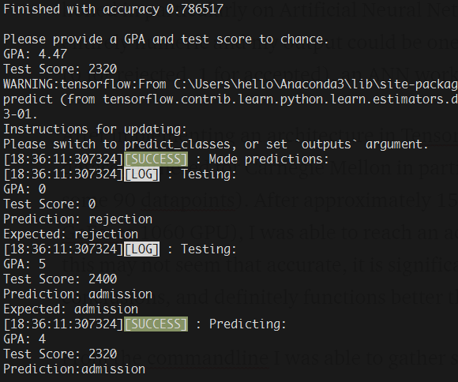
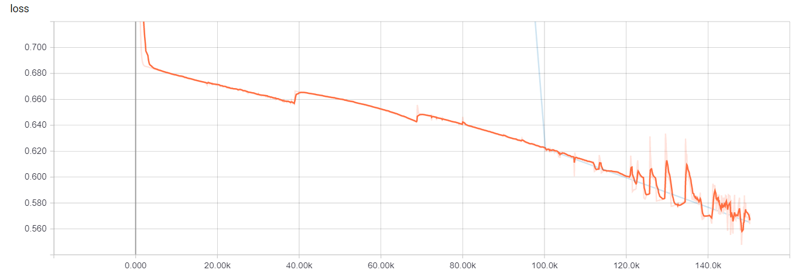
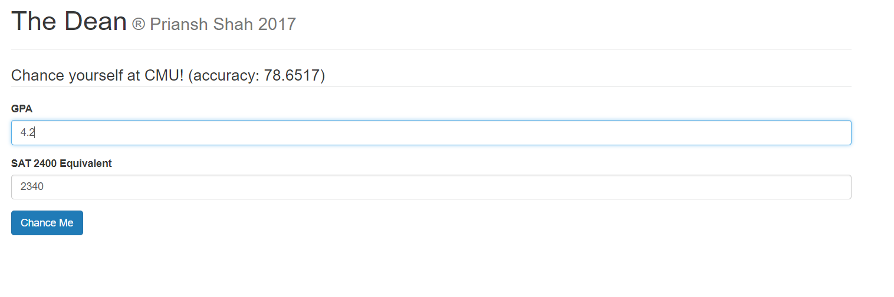

# Chancey, college admissions predictor.

Chancey is a predictor for college admissions based on GPA and SAT2400 data. Surprisingly enough, despite claims of a `holistic` approach, most colleges easily reach ~80% accuracy on this model with ~50 samples of data.

## Reqs

- Python (prefer 3.x)
- Tensorflow (prefer newest, recommend GPU or high powered CPU)
- `console-logging` python module, for more beautiful logs, get it from `pip`
- `numpy`, highly recommend using an Anaconda distribution of Python 3
- `flask`, get it from `pip`

## How it works

This is probably the simplest neural network you'll see today. I simply implemented the DNN Classifier, but instead of using a traditional approach with hundreds of nodes, I messed around with the parameters and brought it to 10-20-10 for hidden layers. Extremely simple implementation and straightforward as both of our inputs are standard numbers.

After training on a corpus of GPA+SAT data, it can predict admissions.

## Training

See the README file in the `neuralnet` folder. You will need to call `main.py` from this directory, e.g. `python neuralnet/main.py .. args ..`.

Assemble a dataset CSV file. Cut 1/3 of the contents into another CSV file, this new file is your test dataset.

**Important: if you want the raw accuracy set both training and testing to same CSV and go for one step. Otherwise it always spits out 0.5 -- this is not correct, it's messing up because there are exactly 11 acceptances and 11 rejections in the test dataset. For you it might spit out another number that is the ratio of acceptances and rejections in test dataset. For these, just train to 150k steps or loss around 0.7 or below.**

I have provided the CMU dataset I originally gathered by hand to train this network. More information on naming datasets is in the README file.

Quick stats: Geforce 1060, 6gb, ~4 minutes for 150k steps and ~78.5% accuracy.

Graph of loss over 150k steps:

Graph of accuracy over 150k steps:

## Predictions

`python website.py`, you'll need Flask.

## FAQS

**Does this mean colleges don't care about me as a person for the most part?**

Perhaps, perhaps not. As my wonderful stat teacher pointed out to me, GPA/SAT are not independent from you as a person. It is likely that many individuals in the dataset had GPA/SAT scores correspondent to their extracurricular activities + essay quality. So no, this does not defiitely prove this. Rather, it suggests that GPA/SAT are powerful metrics that can be used to filter applicants.

**Won't this just scare me away from college apps? How can you be sure this works?**

I'm not sure. That's why the predictor uses language like `likely` and `unlikely`. This isn't perfect, and college admissions are often random and influenced by external factors I can't predict. Don't let this dissuade you from applying to a college. Rather, simply use this to filter through schools if you're like me and had trouble narrowing down your list from 20+.

**Isn't this network way too simple? Shouldn't you add an LSTM layer or RNN capabilities?**

It may be simple but in this case it *works*. I have implemented in later revisions LSTM cells, but this has seen minor improvements and I am not at liberty to open source those parts of the project. Rest assured that these are _minor_ improvements at best, at least in my experience.

If you have any ideas to make this more accurate, feel free to contribute! This repo is open to all.